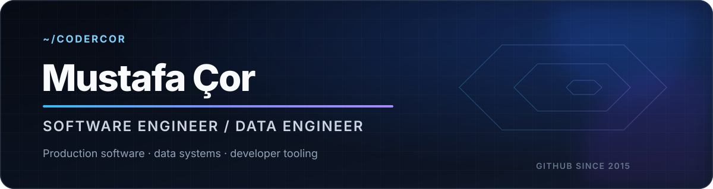

  

  
  
  

## About

I am a software engineer with a public GitHub history dating back to 2015.
I design and build systems end to end: data models, backend services, APIs,
web applications, ML workflows, infrastructure, and deployment.

My work has moved across JavaScript and Node.js systems, Vue and React
applications, TypeScript product engineering, Python and SQL workflows,
cloud services, and developer tooling.

**AI is a tool in my stack, not my job title.** I use it when it solves a
real engineering problem; the work still starts with architecture, data
models, contracts, security, and maintainability.

## Selected engineering work

<table>
  <tr>
    <td width="50%" valign="top">
      <h3>
        <a href="https://github.com/codercor/CENEEE2">
          EV Battery State of Health
        </a>
      </h3>
      

        Server-side battery degradation analysis and prediction system.
        Python services handle preprocessing, exploratory analysis,
        Random Forest and XGBoost training, metrics, and feature importance.
      

      

        <code>Python</code>
        <code>scikit-learn</code>
        <code>XGBoost</code>
        <code>Next.js</code>
      

      

        <a href="https://ceneee2.vercel.app">Live demo</a>
        ·
        <a href="https://github.com/codercor/CENEEE2">Source</a>
      

    </td>
    <td width="50%" valign="top">
      <h3>
        <a href="https://github.com/codercor/english-skills-builder">
          English Skills Builder
        </a>
      </h3>
      

        Full-stack learning platform connecting assessment,
        recommendations, practice, feedback, review, and progress through
        one documented domain model.
      

      

        <code>TypeScript</code>
        <code>PostgreSQL</code>
        <code>Drizzle</code>
        <code>OpenAI API</code>
      

      

        <a href="https://english-practice-area.vercel.app">Live demo</a>
        ·
        <a href="https://github.com/codercor/english-skills-builder">Source</a>
      

    </td>
  </tr>
  <tr>
    <td width="50%" valign="top">
      <h3>
        <a href="https://github.com/codercor/sql-practice-lab">
          SQL Practice Lab
        </a>
      </h3>
      

        Dockerized PostgreSQL environment with a relational dataset,
        70 exercises, result-based evaluation, and transaction rollback
        that protects the seed state.
      

      

        <code>PostgreSQL</code>
        <code>SQL</code>
        <code>Docker</code>
        <code>TypeScript</code>
      

      

        <a href="https://github.com/codercor/sql-practice-lab">Source and setup</a>
      

    </td>
    <td width="50%" valign="top">
      <h3>
        <a href="https://github.com/codercor/ollama-flux2-klein-image-tool">
          Ollama FLUX.2 Tool for Dify
        </a>
      </h3>
      

        Focused Python plugin connecting Dify workflows to Ollama's
        OpenAI-compatible image endpoint and returning generated files
        with workflow-ready metadata.
      

      

        <code>Python</code>
        <code>Dify</code>
        <code>Ollama</code>
        <code>Local AI</code>
      

      

        <a href="https://github.com/codercor/ollama-flux2-klein-image-tool">Source and setup</a>
      

    </td>
  </tr>
</table>

## Engineering stack

### Languages

### Systems and data

### Product engineering

## How I work

- Start with the domain, data model, and system boundaries.
- Prefer explicit contracts and understandable modules over hidden magic.
- Treat security, validation, logs, and failure handling as engineering work.
- Use the simplest architecture that can survive real use and future change.
- Document decisions so another engineer can operate and extend the system.

## Contact

The best way to reach me is through
[LinkedIn](https://www.linkedin.com/in/codercor).
