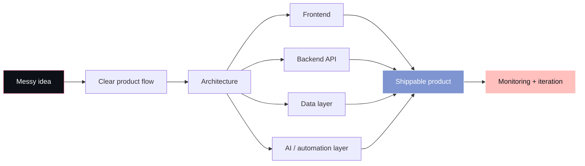

<!--
  README.md for github.com/codercor
  Put this file inside a public repository named: codercor
-->

<div align="center">


<a href="https://git.io/typing-svg">
  
</a>

<br/>

<p>
  <a href="https://codercor.com">
    
  </a>
  <a href="https://www.linkedin.com/in/codercor">
    
  </a>
  <a href="https://twitter.com/codercor">
    
  </a>
  
</p>

</div>

---

## `whoami`

```txt
Mustafa Çor / codercor

I build product-grade software at the intersection of data engineering,
full-stack development, AI systems, automation, and infrastructure.

My favorite kind of work:
taking a messy real-world problem, designing the architecture,
building the product, connecting the data, automating the boring parts,
and making the system reliable enough to actually use.
```

I am especially interested in **data platforms**, **AI agents**, **RAG systems**, **developer tooling**, **full-stack SaaS products**, and **systems that are simple on the surface but strong underneath**.

---

## Current direction

<table>
  <tr>
    <td width="50%">

### Engineering focus

- Data engineering with **Snowflake**, **dbt**, SQL, and data quality checks  
- AI systems with **tool calling**, **RAG**, agent workflows, and controlled automation  
- Full-stack products with **Next.js**, **TypeScript**, **NestJS**, and modern UI systems  
- Production-minded architecture with clean modules, logs, validation, permissions, and deployability  

</td>
<td width="50%">

### Product mindset

- Build fast, but not messy  
- Prefer clear systems over clever chaos  
- Make complex workflows feel like **3 clicks**  
- Design developer experiences that are easy to understand, extend, and debug  
- Treat reliability, observability, and documentation as product features  

</td>
  </tr>
</table>

---

## The kind of systems I like building



---

## Featured work

<table>
  <tr>
    <td width="50%">
      <h3><a href="https://github.com/codercor/face-rekognition-album">Face Rekognition Album</a></h3>
      <p>
        Event-photo discovery system using face recognition.
        Built for photographers and event users to find personal photos from large albums.
      </p>
      <p>
        <b>Core ideas:</b> face search, image indexing, album retrieval, user-facing photo discovery.
      </p>
    </td>
    <td width="50%">
      <h3><a href="https://github.com/codercor/The-Accountant">The Accountant</a></h3>
      <p>
        Business document generator for offers, contract notes, customers,
        products/services, and invoice-style PDF workflows.
      </p>
      <p>
        <b>Core ideas:</b> CRUD flows, PDF generation, business operations, practical automation.
      </p>
    </td>
  </tr>

  <tr>
    <td width="50%">
      <h3><a href="https://github.com/codercor/market-barcode">Market Barcode</a></h3>
      <p>
        Browser and webcam-based barcode software for market/product workflows.
      </p>
      <p>
        <b>Core ideas:</b> webcam scanning, product management, fast in-store utility.
      </p>
    </td>
    <td width="50%">
      <h3><a href="https://github.com/codercor/web3-resident-management">Web3 Resident Management</a></h3>
      <p>
        Blockchain prototype for citizen/resident registration with secure login
        and Solidity-based Ethereum chain registration logic.
      </p>
      <p>
        <b>Core ideas:</b> smart contracts, secure frontend, blockchain-backed records.
      </p>
    </td>
  </tr>
</table>

---

## My engineering stack

<div align="center">

### Frontend


<br/>

### Backend & APIs


<br/>

### Data, AI & Automation


<br/>

### Tools & workflow


</div>

<br/>

<table>
  <tr>
    <td><b>Frontend</b></td>
    <td>React, Next.js, TypeScript, Tailwind CSS, shadcn/ui, Zustand, React Query, GSAP</td>
  </tr>
  <tr>
    <td><b>Backend</b></td>
    <td>NestJS, Node.js, FastAPI, REST APIs, SSE, WebSockets, Zod, modular service architecture</td>
  </tr>
  <tr>
    <td><b>Data</b></td>
    <td>Snowflake, dbt, SQL, PostgreSQL, data modeling, data quality, validation, pipeline reliability</td>
  </tr>
  <tr>
    <td><b>AI systems</b></td>
    <td>RAG, agent workflows, tool calling, LangGraph-style orchestration, ChromaDB, controlled automation</td>
  </tr>
  <tr>
    <td><b>Cloud & infra</b></td>
    <td>AWS, Docker, Nginx, Cloudflare, GitHub Actions, GitLab CI/CD, deployment automation</td>
  </tr>
  <tr>
    <td><b>Web3</b></td>
    <td>Solidity, ERC-721, wallet integrations, Immutable zkEVM, blockchain prototypes</td>
  </tr>
</table>

---

## How I think while building

```ts
type EngineeringPrinciple =
  | "Make the product simple, even if the system is complex."
  | "Design the data model before the UI lies to you."
  | "Automate repetitive work, but keep humans in control."
  | "Logs, validation, and permissions are not extras."
  | "A good system should be explainable after six months.";

const codercor = {
  role: "Data Engineer + Full-Stack Builder",
  focus: ["data platforms", "AI agents", "SaaS products", "developer tools"],
  style: "terminal-minded, product-focused, reliability-driven",
  goal: "ship systems that people can actually use, trust, and extend",
};
```

---

## Selected project themes

| Area | What I like building |
| --- | --- |
| **Data Engineering** | dbt validations, data quality checks, analytics models, monitoring flows |
| **AI Agents** | tool-calling systems, RAG pipelines, approval-gated automation, agent UIs |
| **Full-Stack SaaS** | dashboards, admin panels, auth flows, role-based systems, dynamic pages |
| **Computer Vision** | event-photo discovery, AWS Rekognition, image search, face indexing |
| **Developer Tools** | automation scripts, CI/CD helpers, internal tools, documentation generators |
| **Infrastructure** | Dockerized apps, Nginx routing, Cloudflare setup, one-command deployments |

---

## GitHub signal

<div align="center">


<br/>


</div>

---

## A small terminal window into my brain

```bash
$ codercor --mode build

> reading problem...
> removing unnecessary complexity...
> designing clean data flow...
> building frontend with taste...
> connecting backend with strong contracts...
> adding logs, validation, permissions...
> shipping the first useful version...
> improving with real feedback...

status: always learning
```

---

## What I am open to

I am open to global opportunities where I can work on:

- data platforms and analytics engineering  
- AI-assisted developer tools  
- full-stack product engineering  
- automation-heavy internal platforms  
- SaaS products with real business workflows  
- engineering teams that value clarity, ownership, and shipping  

---

## Contact

<div align="center">

<a href="https://codercor.com">
  
</a>
<a href="https://www.linkedin.com/in/codercor">
  
</a>
<a href="https://twitter.com/codercor">
  
</a>

<br/><br/>


</div>
