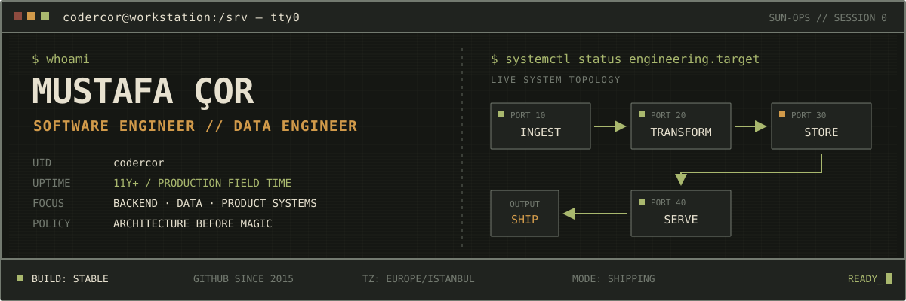
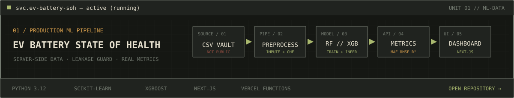
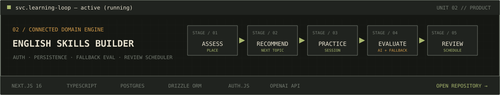
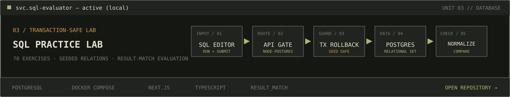
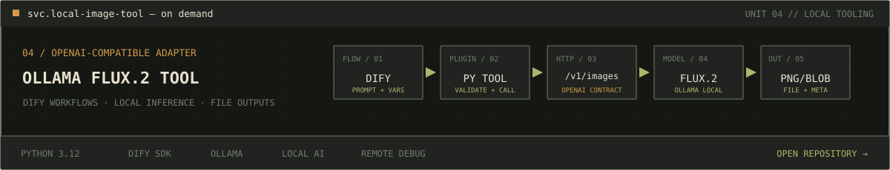
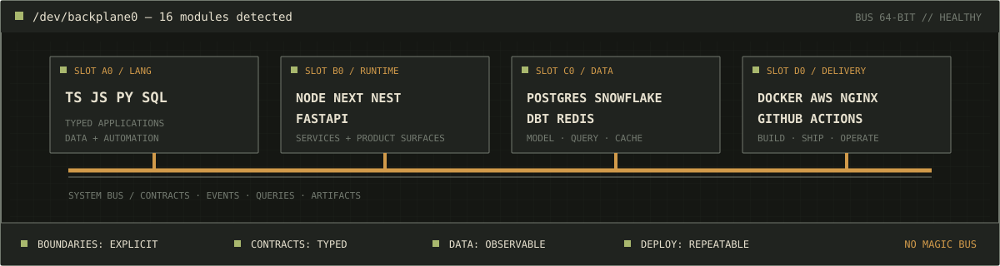
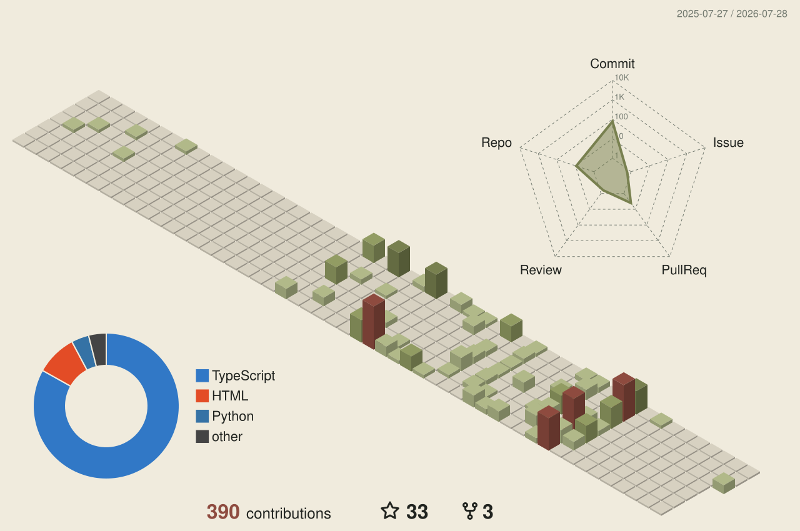

  

  <a href="https://www.linkedin.com/in/codercor"><code>LINKEDIN://CONNECT</code></a>
  &nbsp;·&nbsp;
  <a href="https://github.com/codercor?tab=repositories"><code>GITHUB://ALL_REPOSITORIES</code></a>

## `SERVICES / SELECTED SYSTEMS`

## `BACKPLANE / TOOLCHAIN`

  

## `TELEMETRY / 365-DAY SURFACE`

  

  
<code>man codercor</code>

   
  

    Software engineer with 11 years of hands-on development across backend
    systems, data platforms, product engineering, ML workflows, infrastructure,
    and deployment. I use AI where it solves an engineering problem; the work
    still starts with architecture, data models, contracts, security, and
    maintainability.
  

  

    <a href="https://www.linkedin.com/in/codercor">LinkedIn</a>
    ·
    <a href="https://github.com/codercor?tab=repositories">All repositories</a>
  

